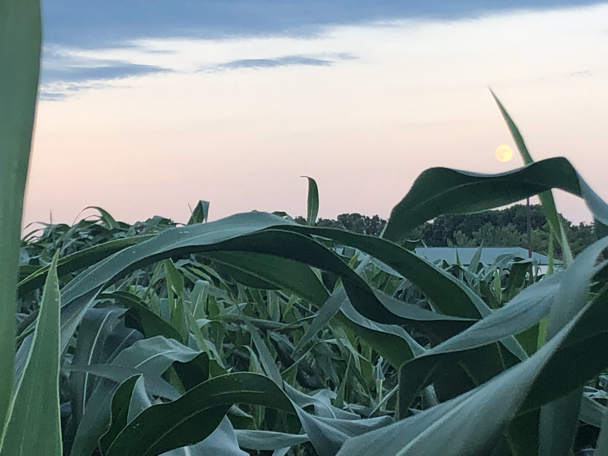
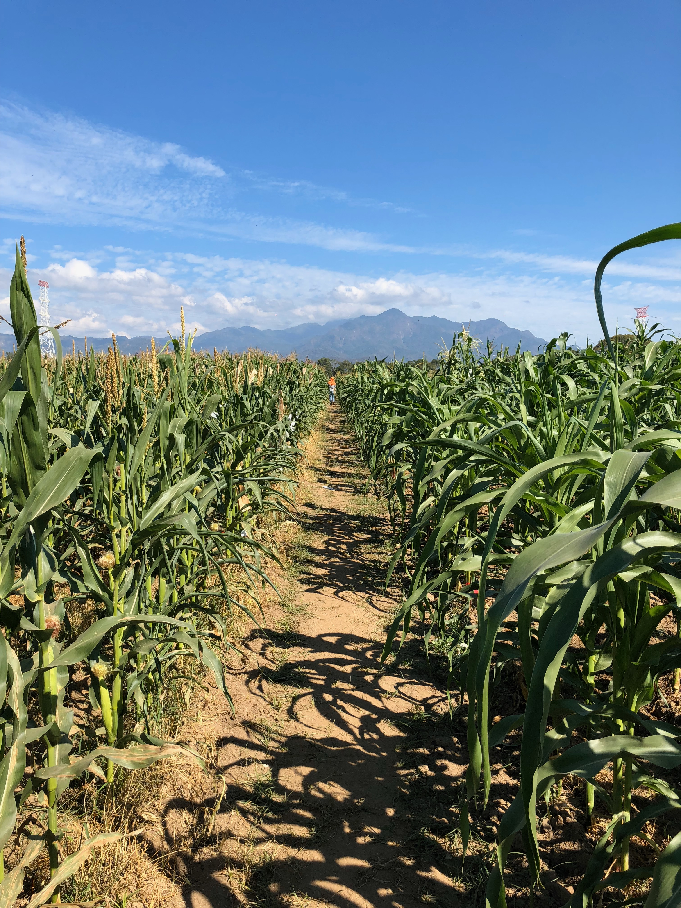

# Dr. Samantha Snodgrass' Research
**_This site is under development! Thank you for your patience!_**

## Current Research
**NSF Postdoctoral Fellow at University of California Davis** (_February 2024 - January 2027_) sponsored by and collaborating with [Dr. Jeffrey Ross-Ibarra]([url](http://rilab.ucdavis.edu/)) and [Dr. Graham Coop](https://gcbias.org/). 

_Human domestication of maize as bio-cultural coevolution_

Plant domestication and agriculture are key innovations underlying the expansion of human civilization. 
The process of domestication can result in tight dependencies between the domesticate and humans.
For instance, maize cannot persist outside of human cultivation yet has a global range, being brought to and adapted for extremely different environments by humans given its vital role as a food source. 
While much is known about where and when maize was domesticated from archeology and genetics research, there is limited understanding of how maize moved between early farmer communities as well as which traits were selected for and the strength of that selection during the initial period of the domestication process.
This project aims to use population genetics and create methods to address these long standing questions in maize, with the potential to apply these methods to other crops of the Americas. 
Understanding these dynamics could reveal why species vary in the ease of being domesticated at a genetic level and thus could be used to accelerate domestication efforts of _de novo_ crops or improvement efforts of locally important orphan crops. 

[Read the full grant abstract here](https://www.nsf.gov/awardsearch/showAward?AWD_ID=2305694&HistoricalAwards=false) 

# Publications (Reverse Chronological Order)
1.	In Review: Gates, D.J., D. Runcie, G.M. Janzen, A. Romero-Navarro, M. Willcox, K. Sonder, **S.J. Snodgrass**, F. Rodríguez-Zapata, R.J.H. Sawers, R. Rellán-Álvarez, E.S. Buckler, S. Hearne, M.B. Hufford, J. Ross-Ibarra. Single-gene resolution of locally adaptive genetic variation in Mexican maize. [preprint](https://www.biorxiv.org/content/10.1101/706739v1)
2.	Ning Yang, Yuebin Wang, Xiangguo Liu, Minliang Jin, Miguel Vallebueno-Estrada, Erin Calfee, Lu Chen, Brian P. Dilkes, Songtao Gui, Xingming Fan, Thomas K. Harper, Douglas J. Kennett, Wenqiang Li, Yanli Lu, Jingyun Luo, Sowmya Mambakkam, Mitra Menon, **Samantha Snodgrass**, Carl Veller, Shenshen Wu, Slying Wu, Yingjie Xiao, Xiaohong Yang, Michelle Stitzer, Daniel Runcie, Jianbing Yan, Jeffrey Ross-Ibarra. 2023. “Two Teosintes Made Modern Maize” _Science_ 382(6674) [doi.org/10.1126/science.adg8940](https://doi.org/10.1126/science.adg8940)
3.	Thomas Hartwig, Michael Banf, Gisele Passaia Prietsch, Jia-Ying Zhu, Isabel Mora-Ramírez, Jos H. M. Schippers, **Samantha J. Snodgrass**, Arun S. Seetharam, Bruno Huettel, Judith M. Kolkman, Jinliang Yang, Julia Engelhorn, & Zhi-Yong Wang. 2023 “Hybrid allele-specific ChIP-seq analysis identifies variation in brassinosteroid-responsive transcription factor binding linked to traits in maize” _Genome Biology_ 24 doi: [https://doi.org/10.1186/s13059-023-02909-w](https://doi.org/10.1186/s13059-023-02909-w)
4.	Corrinne E Grover, Mark A Arick, II, Adam Thrash, Joel Sharbrough, Guanjing Hu, Daojun Yuan, **Samantha Snodgrass**, Emma R Miller, Thiruvarangan Ramaraj, Daniel G Peterson, Joshua A Udall, Jonathan F Wendel. “Dual Domestication, Diversity, and Differential Introgression in Old World Cotton Diploids” _Genome Biology and Evolution_, Volume 14, Issue 12, December 2022, evac170,[ https://doi.org/10.1093/gbe/evac170](https://doi.org/10.1093/gbe/evac170)
5.	Matthew B. Hufford, Arun S. Seetharam, Margaret R. Woodhouse, Kapeel M. Chougule, Shujun Ou, Jianing Liu, William A. Ricci, Tingting Guo, Andrew Olson , Yinjie Qiu, Rafael Della Coletta, Silas Tittes, Asher I. Hudson, Alexandre P. Marand, Sharon Wei, Zhenyuan Lu, Bo Wang, Marcela K. Tello-Ruiz, Rebecca D. Piri, Na Wang, Dong won Kim, Yibing Zeng, Christine H. O’Connor, Xianran Li, Amanda M. Gilbert, Erin Baggs, Ksenia V. Krasileva, John L. Portwood II, Ethalinda K.S. Cannon, Carson M. Andorf, Nancy Manchanda, **Samantha J. Snodgrass**, David E. Hufnage, Qiuhan Jiang, Sarah Pedersen, Michael L. Syring, David A. Kudrna, Victor Llaca, Kevin Fengler, Robert J. Schmitz, Jeffrey Ross-Ibarra, Jianming Yu, Jonathan I. Gent, Candice N. Hirsch, Doreen Ware, R. Kelly Dawe. 6 August 2021. "De novo assembly, annotation, and comparative analysis of 26 diverse maize genomes" _Science_ [https://doi.org/10.1126/science.abg5289](https://doi.org/10.1126/science.abg5289)
6.	Ou, S., J. Liu, K.M. Chougule, A. Fungtammasan, A.S. Seetharam, J. Stein, V. Llaca, N. Manchanda, A.M. Gilbert, X. Wei, C. Chin, D.E. Hufnagel, S. Pedersen, **S. Snodgrass**, K. Fengler, M. Woodhouse, B.P. Walenz, S. Koren, A.M. Phillippy, B. Hannigan, R.K. Dawe, C.N. Hirsch, M.B. Hufford, Doreen Ware. 2020. Effect of sequence depth and length in long-read assembly of the maize inbred NC358. _Nature Communications_ 11(1):2288. [doi: 10.1038/s41467-020-16037-7](https://www.nature.com/articles/s41467-020-16037-7)
7.	**Snodgrass, S.J.**, M.B. Hufford. 2018. “Domestication Genomics: untangling the complex history of African rice”. _Current Biology_. 28: R786-R788 [https://doi.org/10.1016/j.cub.2018.05.072](https://doi.org/10.1016/j.cub.2018.05.072)
8.	Manchanda, N., **S.J. Snodgrass**, J. Ross-Ibarra, M.B. Hufford. 2018. Evolution and adaptation in the maize genome. In The Zea mays Genome, Bennetzen, Flint-Garcia, Hirsch, Tuberosa (Eds.), Springer Nature Publishing
9.	**Snodgrass, S.**, Jareczek, J., Wendel, J. F. 2017. “An examination of nucleotypic effects in diploid and polyploid cotton” _Annals of Botany_ 9 [doi:10.1093/aobpla/plw082](https://doi.org/10.1093/aobpla/plw082)

[Learn more about the grants, awards, and fellowships I've received here](pages/GrantsAwardsFellowships.md)

## Ph.D. at Iowa State University in the Hufford Lab

**Ph.D. in Plant Biology awarded January 2024**

My Ph.D thesis centers on the genetic models of hybrid vigor and genome evolution across the genus *Zea* and *Tripsacum*. 
By understanding how evolutionary and population dynamics have affected the genome structure of maize and its wild relatives, and then relate those processes to phenotype, this research provides foundational information to plant domestication, which can be used to improve existing crops or accelerate domestication of wild plants or orphan crops. 

[Learn more about my Ph.D. research projects here](pages/PhDresearch.md)

# Teaching 

**I teach to serve others and prepare students to tackle the problems of the 21st century.**

I believe that education can improve lives and help solve global and local challenges. 
In that spirit, I view classrooms as an environment where students can discover and apply new ways of thinking, forge connections, and engage their creativity and critical thinking skills. 
My role as an educator is to build an environment and course that enables these experiences and is supported by pedagogical research. 
I have a broad array of teaching experiences across institutions in biological sciences and general academic support. 
I am excited to pursue opportunities to develop course materials and teach classes in general biology, plant biology, evolutionary genetics, and computational skills for biologists. 

[See more about my teaching philosophy and experience here](pages/Teaching.md)

# Service

I believe in supporting the scientific communities at local, national, and international scales through service. 
I have completed extensive service throughout my career such as supporting graduate students, contributing to community databases, and assisting conference organization. 

[See more about my service experiences here](pages/Service.md)
