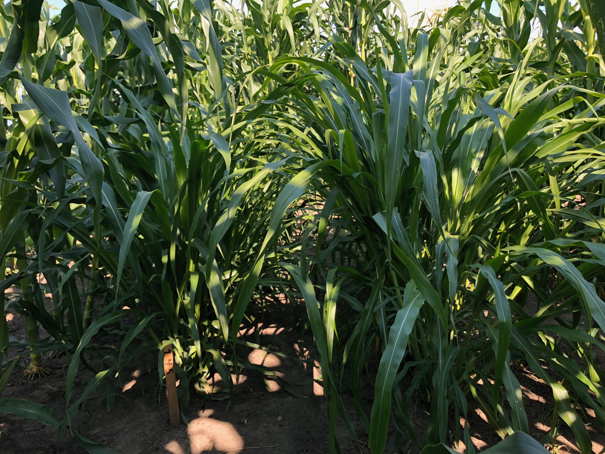

# Research Projects

_Note: Descriptions of these projects are modeled after the abstracts of each chapter in my dissertation, which is available through the Iowa State University library_

[Return to main page](https://snodgras.github.io/)

## Fractionation in the _Tripsacinae_ subtribe
[Project github repo](https://github.com/Snodgras/Zea_Fractionation)
_Note: github repo may be private until publication_

Despite the commonality of polyploidy, plant genomes are smaller than expected due to the process of gene loss called fractionation.
Fractionation is known to affect different subgenomes (copies of the ancestral diploid genome) to varying extents in allopolyploids. 
Typically one subgenome is preferentially retained and the other preferentially lost overall. 
While previous work has estimated most fractionation happens immediately after the inciting polyploidy event and before descendent lineages diverge, few studies have had a large sampling of descendent genomes from the same whole genome duplication event. 
The _Tripsacinae_ subtribe of grasses which includes the genera _Tripsacum_ and _Zea_ originates from an ancient alloployploid (~12-5 MYA).
My collaborators and I used the publicly available genomes for the _Tripsacinae_ subtribe of grasses to investigate the patterns and timing of fractionation. 

Our results support the majority of fractionation happening soon after the ancient polyploid formation and that one subgenome is preferentially retained across all descendent species, which is in line with previous work in the system. 
However, there appear to be significant differences between the genera _Zea_ and _Tripsacum_, potentially related to differences in chromosomal rearrangement histories that demarcate these genera. 
Among other results (stay tuned for the preprint when it's released later in 2024!), this work suggests that fractionation is a much more dynamic process than previously predicted in the the _Tripsacinae_.

## Single parent expression across a diverse maize hybrid population and F1 heterosis
[Project github repo](https://github.com/Snodgras/Diallel_Hybrid_Analysis)
_Note: github repo may be private until publication_

Hybrid vigor is a common phenomenon where hybrid offspring grow faster, are more robust, and yield more than expected given the traits of the parents. 
Of the models developed to explain the phenomenon, the complementation model is the one with most support.
In this model, populations in reproductive isolation differentially accumulate and fix slightly deleterious recessive alleles. 
When the populations are brought back into reproductive contact (F1 hybrids), those slightly deleterious recessive alleles are masked.
The complementation model has been invoked to link extreme differential expression pattern, single parent expression (SPE), to trait heterosis. 
SPE, where one parent and the hybrid express a gene which is silent in the other parent, is expression complementation and results in more total genes expressed in the hybrid. 
Additionally, more distant crosses should result in more SPE and heterosis. 
However, previous work only made crosses between temperate lines to investigate SPE or had not linked SPE patterns to phenotypes. 

Here, we created a diallel hybrid population using 13 diverse founder lines to span a breadth of genetic distances between parents, including temperate and tropical germplasm. 
This population was phenotyped for 14 traits including growth rate, plant architecture, and yield in field conditions, Ames, IA 2020. 
The half diallel was sequenced using 3’ QuantSeq to identify SPE genes. 

SPE was genotype specific, on average identified in one to two genotypes. 
The total number of SPE genes was not related with genetic distance or hybrid group per se, but sharing of SPE calls increased between genotypes of more closely related hybrid groups. 
Traits demonstrated varying levels of heterosis with some legacy of temperate hybrid breeding programs observed. 
However, heterosis was not maximized in historically important crosses such as those between non-stiff stalk and stiff stalk lines, but was positively correlated with genetic distance of the parents. 
Significant correlations were found between the amount of SPE genes called in each genotype and the amount of heterosis observed for a limited number of traits. 
In total, this supports the complementation model of heterosis and a tentative relationship between gene expression complementation and trait heterosis.

## Phenotypic variation in maize can be largely explained by genetic variation at transcription factor binding sites
[Preprint available on bioRxiv](https://www.biorxiv.org/content/10.1101/2023.08.08.551183v1)
[Project github repo](https://github.com/Snodgras/MOA_Analysis)

Here, high quality genome assemblies are paired with novel techniques to identify transcription factor binding sites and established mapping populations. 
Together, they allow us to quantify the contributions of variability at transcription factor binding sites versus the overall variability of traits. 
We conducted a variance component analysis using high resolution transcription factor binding sites to quantify the amount of trait variation associated with these sites. 
We found that the majority of traits analyzed were explained mostly by variance at these transcription factor binding sites.

[Return to main page](https://snodgras.github.io/)
