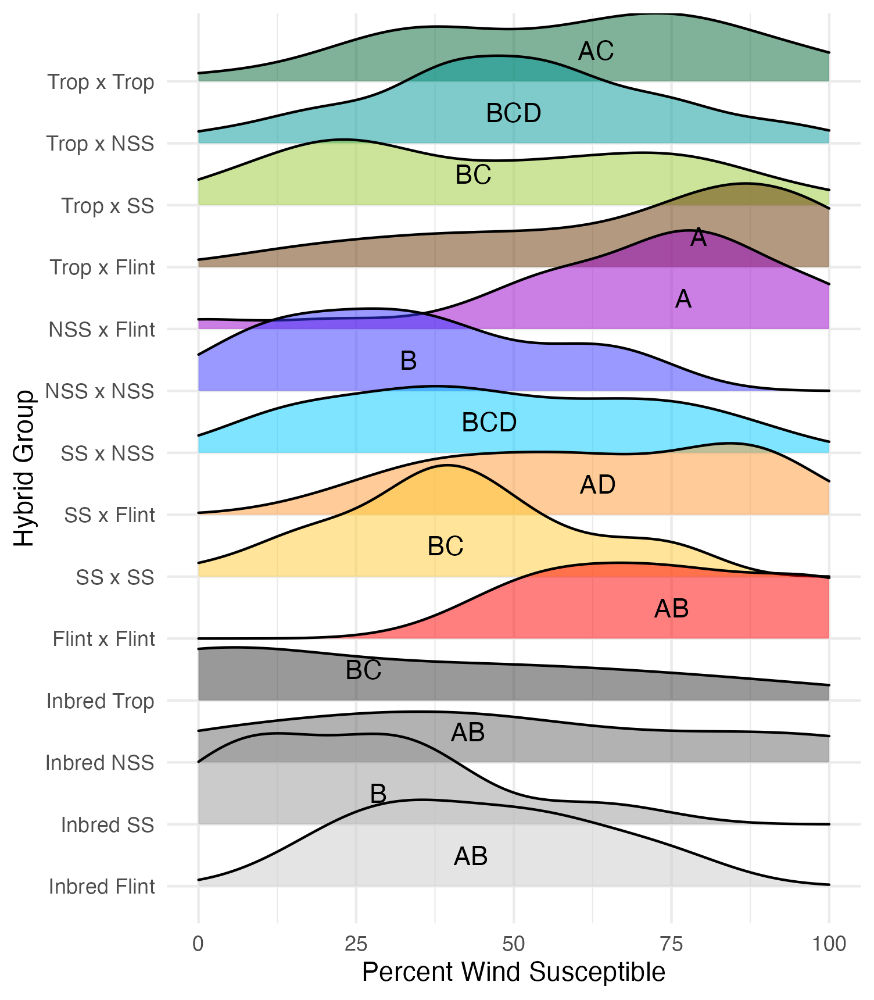

# Gallery of SPE and Trait Results
_Because it can't all fit on a poster_

[Return to main page](https://snodgras.github.io/)
[Return to Ph.D. research page](../PhDresearch.md)

# A little background

**Heterosis** is a phenomenon where the F1 hybrid does better than expected given the performance of its parents. 
And by performance, this could be any measurable trait. 
The expectation is that an F1 hybrid will have a trait value that is intermediate to that of its parents (the mid-parent value). 
When the F1 hybrid deviates from the mid-parent value, it is considered **mid-parent heterosis (MPH)**. 
When the F1 hybrid exceeds the range of the parents, and thus outperforms the better or best parent, it is considered **best or better- parent heterosis (BPH)**.

We developed a diallel hybrid population using 13 diverse maize lines. 
A **diallel** population means that every possible combination of parents was created in both directions. 
The lines were chosen to span both historically important temperate hybrid breeding populations (stiff stalk and non-stiff stalk) as well as genetically diverse populations (flint and tropical). 

In 2020, the full population was phenotyped for a variety of traits in Ames, IA. 
Each F1 and inbred genotypes were planted in 3 complete, randomized blocks. 
The following are the trait results from that phenotyping experiment. 

# Trait Results
## Growth Rate and Flowering Time

Vegetative stages of a plant is measured by counting the number of fully expanded leaves (auricles are fully visable and separated).
Flowering stages such as anthesis (shedding) and silking are recorded once the first anthers and silks emerge respectively.
Once half the row has reached a certain developmental stage, the row is recorded as reaching that stage on that particular day since planting.
Thus growth rate is measured as the number of days to reach a particular stage. 

Overall growth rate by days to stage. 
Points are individual rows of a given genotype in the field. 
Colors are for the hybrid group those genotypes belong to. 
Lines represent line of best fit using `geom_smooth` for each hybrid group. 

Growth rate can also be normalized by using growing degree days (GDD). 
Since maize development is highly tied to heat, GDD can be used in place of days to be able to compare data across years. 

Heterosis for better performance for growth rate is any value that is below the 0 mark (the parental value being compared to). 
This means that the hybrid genotype either got to a developmental stage faster than the average of its parents (mid-parent heterosis) or faster than its fastest growing parent (better-parent heterosis). 

## Plant and Ear Height
Our heights were measured on 5 cm increments. Plant height is measured from the base of the plant (ground) to the flag leaf. Ear height is measured from the base of the plant (ground) to the upper most or primary ear. 

Heterosis for plant and ear height is for any value that is over 0 (the parental value being compared to). 
This means that that plant was taller than either the average of its parents (mid-parent heterosis) or taller than its tallest parent (better-parent heterosis).

 

## Tassel Length and Branch Number

Tassel length is measured from the base of the flag leaf to the tip of the tassel's central spike. 
We used the same measuring device as plant and ear height, so these are also in 5 cm increments. 
Tassel branch number is the number of primary spikes off the tassel's central spike. 

Heterosis for tassel length and tassel branch number would be any value above 0 (the parental value). This would mean that tassels are longer and/or branchier than either the average of the parents (mid-parent heterosis) or the parent with the longest/branchiest tassel (better-parent heterosis).

## Ear Traits
### Ear Width and Length

Ear width is measured as the widest part of the ear (cm). 
Ear length is measured as the length of the ear (cm). 

Heterosis for ear width and length means that the values are greater than 0 (parental value). This means that ears are wider and/or longer than either the average of its parents (mid-parent heterosis) or its parent with the widest/longest ears (better parent heterosis). 

### Kernel Row Number, Kernel Height, Cob Width

To get at these traits, it is easiest to cut the un-shelled cob in half. 
Kernel row number is the number of kernel rows going around the circumference of the cob. 
Cob width is the width of the cob, roughly in the middle of the cob where the cut point is made. 
Kernel height is calculated by subtracting the cob width from the ear width, thus getting a measure of how "fat" the kernels are. 

Heterosis for these traits would been seen as values greater than 0 (parental value). This means that the hybrid has wider cobs, taller kernels, and/or more rows of kernels than either the average of its parents (mid-parent heterosis) or its parent with the widest cobs, tallest kernels, and/or most rows of kernels. 

## Yield Traits
### Cob Weight, 50 Kernel Weight, and Total Kernel Weight

Cob weight is the total weight of just the cob in grams. 
50 kernel weight is the weight of 50 kernels from the ear. 
Most ears had more than 50 kernels, though there were a few inbreds that did not have 50 kernels. 
Total kernel weight is the weight of all the kernels shelled from a single ear. 

Heterosis for these traits would be any values above 0 (the parental value). This would mean the hybrid has a heavier cob weight, 50 kernel weight, and/or total kernel weight than either the average of the two parents (mid-parent heterosis) or the parent with the heaviest cobs, 50 kernels, and/or total kernel weight (better parent heterosis). 

## Wind Resistance

There was a derecho on August 10th which resulted in Category 3 hurricane level winds. 
There was mixed results in terms of how resistant the different hybrid genotypes were to this wind event. 
The three possible states were: standing, lodged, or snapped. 
Standing means that the plants remained erect and undisturbed. 
Lodged means that the stem was still intact, but significant bending had occurred. 
Snapped means that the stem was broken, likely either at ear height or below. 
For each of these states, the percentage of the row in a given state was recorded. 

Wind susceptibility was the combined percentage of lodged and snapped plants. 

# Single Parent Expression Results
Single parent expression (SPE) is when a given gene is expressed in one parent and the F1 hybrid, but not in the other parent.

[Return to main page](https://snodgras.github.io/)
[Return to Ph.D. research page](../PhDresearch.md)
