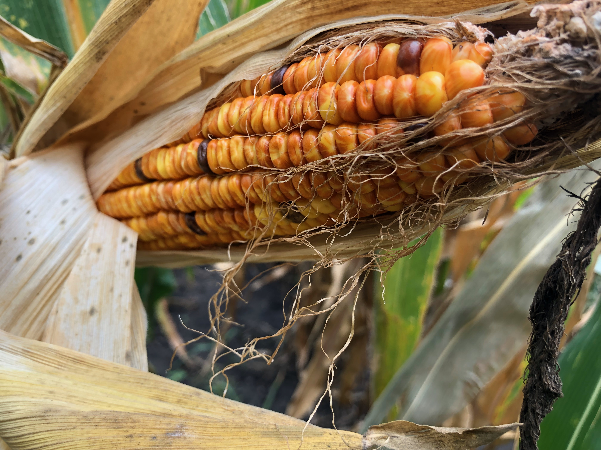

# Teaching Philosophy

I truly believe that education can improve lives and encompasses more than the course topics. 
I am committed to building an environment where students can discover and apply new ideas in ways that are enhance their knowledge, forge connections between disciplines and current events, and engage their creativity, critical thinking, and collaboration skills. 
As a product of extensive, research-backed teaching methods, I know the power and potential of thoughtful and informed course design. 
I intend to continue implementing lessons from my previous experiences, but also look forward to potential partnerships with scholars of teaching and learning. 
Through the iterative process of experimentation, reflection, and research, I plan to continue improving my pedagogy and courses towards a better model of biology in higher education. 

[Return to the main page](https://snodgras.github.io/)

# Teaching Experience

## Iowa State University

**Teaching Assistant of BIOL312L: Ecology Lab**, Iowa State University _(Fall semester 2023)_
* Led and facilitated ~40 upper level undergraduates through ecology laboratories
* Focused on building data analysis and scientific writing skills of students

**Instructor of Record of BIOL315: Evolution**, Iowa State University _(Spring semester 2023)_
* Revised and presented all lectures for a class of ~130 upper level undergraduates
* Created new assignments in collaboration with the TA to better fulfill learning objectives

**Teaching Assistant of BIOL315: Evolution**, Iowa State University _(Fall semester 2022)_
* Assisted in grading and creating assessments

**Guest Lecture on Plant Anatomy**, Iowa State University _(Sept. 20, 2021)_
* Uploaded to Coursera as part of the Introduction to Predictive Plant Phenomics Class

## Grinnell College

**Partners in Education Post-Baccalaureate Fellow**, Grinnell College _(Jan. 2017 – May 2017)_
* Provided tutoring and support for at-risk first year undergraduate students
* Engaged participants through outreach and connected students with campus resources

**Undergraduate Biology Mentor**, Grinnell College
* Biology: Molecules, Cells, and Organisms _(Fall semester 2014, 2015)_
* Biology: Organisms, Evolution and Ecology _(Spring semester 2016)_
* Led twice weekly, hour long mentor sessions with a flipped learning model
* Facilitated discussion, serving as a bridge between students and professor
* Advised biology/biochemistry majors on subsequent advanced courses

[Return to the main page](https://snodgras.github.io/)
